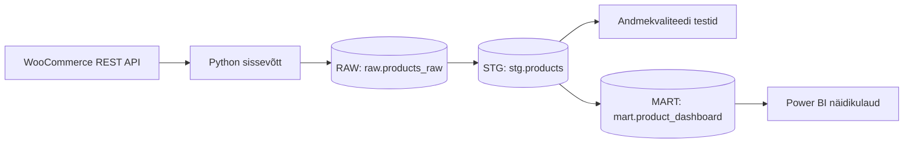

# WooCommerce — WooCommerce Product Status Pipeline

## Äriküsimus

Projekt aitab vastata küsimusele, millised e-poe tooted on müügiks valmis ning milline on nende laoseisu ja avaldamise staatus. Lahendus annab mikroettevõttele ühtse ülevaate toodete seisust ning aitab paremini jälgida, millised tooted vajavad tähelepanu enne müüki või nähtavaks tegemist.


**Mõõdikud:**

1. Toodete arv staatuse järgi: avalik, mustand, ootel või privaatne
2. Toodete laoseis SKU ja toote järgi
3. Toodete arv laoseisu staatuse järgi: laos, laost otsas või järeltellimisel

## Arhitektuur



Täpsem kirjeldus: [`docs/arhitektuur.md`](docs/arhitektuur.md)

## Andmestik

| Allikas | Tüüp | Ajas muutuv? | Roll |
|----------|------|--------------|------|
| WooCommerce REST API | API | Jah | Toodete staatus, SKU-d ja laoseis |

## Stack

| Komponent | Tööriist |
|------------|----------|
| Sissevõtt | Python |
| Transformatsioon | Python, Pandas, SQL |
| Andmehoidla | PostgreSQL |
| Andmekvaliteet | SQL |
| Näidikulaud | Streamlit |
| Käivitamine | Docker Compose |

## Käivitamine

```bash
# 1. Klooni repo ja liigu kausta
git clone <repo-url>
cd <projekti-kaust>

# 2. Kopeeri keskkonnamuutujad
cp .env.example .env
# Muuda .env failis paroolid ja muud seaded vastavalt vajadusele

# 3. Käivita teenused
docker compose up -d --build

Näidikulaud: http://localhost:8501

## Saladused ja konfiguratsioon

Kõik saladused (paroolid, API võtmed, andmebaasi URL-id) on `.env` failis. Repos on ainult `.env.example`, mis näitab vajalike muutujate struktuuri ilma tegelike väärtusteta. Päris `.env` faili ei tohi GitHubi panna - see on `.gitignore`-s.

Vajalikud muutujad:

| Muutuja | Tähendus |
|----------|----------|
| POSTGRES_USER | PostgreSQL kasutajanimi |
| POSTGRES_PASSWORD | PostgreSQL parool |
| POSTGRES_DB | PostgreSQL andmebaasi nimi |
| DB_HOST | PostgreSQL host |
| DB_PORT | PostgreSQL port |
| WC_API_URL | WooCommerce API URL |
| WC_CONSUMER_KEY | WooCommerce API võti |
| WC_CONSUMER_SECRET | WooCommerce API saladus |


## Andmevoog lühidalt

1. **Sissevõtt** — Python rakendus pärib toodete andmed WooCommerce REST API-st ning salvestab need RAW kihti JSONB kujul.
2. **Laadimine** — Andmed teisendatakse struktureeritud tabelkujule ja laaditakse `stg.products` tabelisse.
3. **Transformatsioon** — Luuakse analüüsiks vajalikud tunnused, näiteks `in_stock` ja `inventory_status`, ning andmed salvestatakse MART kihti.
4. **Testimine** — 5 andmekvaliteedi testi kontrollivad puuduvaid ID-sid, negatiivseid laoseise, vigaseid staatuseid ja duplikaate.
5. **Näidikulaud** — Power BI kuvab toodete staatuseid, laoseisu infot ja ülevaadet müügiks valmis toodetest.

## Andmekvaliteedi testid

Projekt kontrollib järgmist:

1. `product_id` ei tohi olla tühi (NULL)
2. `stock_quantity` ei tohi olla negatiivne
3. `product_status` peab olema üks lubatud väärtustest (`publish`, `draft`, `pending`, `private`)
4. `stock_status` peab olema üks lubatud väärtustest (`instock`, `outofstock`, `onbackorder`)
5. `product_id` peab olema unikaalne ning ei tohi esineda duplikaatidena

Testide tulemused: `quality.product_rule_results`

## Projekti struktuur

```text
.
├── init/
│   └── 001_create_schemas.sql      # Loob PostgreSQL skeemid ja RAW tabeli
├── scripts/
│   ├── main.py                     # ETL pipeline: RAW → STG → QUALITY → MART
│   └── quality.sql                 # Andmekvaliteedi kontrollid
├── dashboard/
│   └── app.py                      # Streamlit näidikulaud
├── README.md
├── compose.yml
├── .env.example
└── .gitignore
```

## Kokkuvõte, puudused ja võimalikud edasiarendused

### Kokkuvõte

- Loodud on WooCommerce API põhine ETL pipeline.
- Rakendatud on medaljoni arhitektuur (RAW → STG → MART).
- Lisatud on SQL-põhised andmekvaliteedi kontrollid.
- Loodud on Streamlit näidikulaud toodete ja laoseisu jälgimiseks.


### Puudused

- Praegu kasutatakse ainult WooCommerce API andmeid.
- STG ja MART tabelid kirjutatakse igal käivitamisel üle.
- Ajaloolisi snapshotte ei säilitata.
- Airflow põhine orkestreerimine puudub.

### Edasiarendused

- Lisada Airflow ajastamine.
- Lisada ajalooliste andmete säilitamine.
- Lisada täiendavad kvaliteedikontrollid.
- Luua eraldi dimensiooni- ja faktitabelid.
- Lisada täiendavad ärilised andmeallikad.

## Meeskond

| Nimi | Roll |
|--------|--------|
| Merri Elizabeth Laidma | Andmeallika ja sissevõtu omanik |
| Lisanne Siniväli | Transformatsioonide ja MART kihi omanik |
| Eva Radhaa | Andmekvaliteedi kontrollide omanik |
| Katrin Saareli | Näidikulaua omanik |
