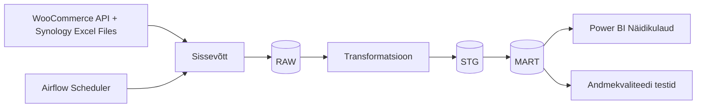

# Arhitektuur

> **Juhend:** See fail on projektitöö esimese nädala väljund. Asenda kõik nurksulgudes plankid oma projekti tegeliku sisuga. Kustuta see juhendrida.

## Äriküsimus

**Äriküsimus**
Kuidas saab Stillform hoida selget ülevaadet ja kontrolli veebipoe toimimise, laoseisu liikumise, tarnijate, vastavusnõuete ja toodete valmisoleku üle enne, kui probleemid mõjutavad kliente või müüki?

**Väärtus**
Töölaud annab ühe usaldusväärse vaate operatsioonidele, kuludele, riskidele, vastavusnõuetele, tarnijate järeltegevustele ja tootearendusega seotud otsustele väikese ühe inimese ettevõtte jaoks.

## Mõõdikud

1. Laoseisu piisavus — arvutatakse olemasoleva laoseisu ja prognoositava müügi põhjal, et tuvastada tooted, mille varu võib lähiajal otsa lõppeda.
2. Tarnijate täitmise usaldusväärsus — mõõdetakse tarnete õigeaegsuse, hilinemiste ja täitmata tellimuste osakaalu põhjal, et hinnata tarnijatega seotud riske.

## Andmeallikad

| Allikas | Tüüp | Ajas muutuv? | Roll |
|---------|------|--------------|------|
| WooCommerce REST API | API | Jah, [iga X tundi / päeva] | [Milleks kasutatakse?] |
| [Nimi] | [seed / dim-tabel] | Ei, staatiline | [Milleks kasutatakse?] |

## Andmevoog

> Täpsusta diagrammi vastavalt oma projektile — lisa rohkem andmeallikaid, mudeleid või teenuseid.

## Andmebaasi kihid

| Kiht | Roll |
|------|------|
| `raw` | Hoiab WooCommerce API-st ja Synology Excel failidest sisse loetud toorandmeid võimalikult töötlemata kujul. |
| `stg` | Hoiab puhastatud ja standardiseeritud andmeid, mida kasutatakse edasiseks analüüsiks ja transformatsioonideks. |
| `mart` | Hoiab transformeeritud ja äriloogikat sisaldavaid tabeleid ning KPI-sid, mida kasutatakse Power BI näidikulaual. |

## Tööjaotus

| Roll | Vastutus | Täitja |
|------|----------|--------|
| Andmeallika omanik | Kirjutab sissevõtu loogika, hoiab API-t töös | Merri Elizabeth Laidma |
| Transformatsioonide omanik | Kirjutab mart kihi mudelid ja mõõdikute arvutuse | Lisanne Siniväli |
| Kvaliteedi omanik | Kirjutab testid ja vaatab läbi ebaõnnestunud kontrollid | Eva Radhaa |
| Näidikulaua omanik | Ehitab näidikulaua ja seob selle äriküsimusega | Katrin Saareli |

## Riskid

| Risk | Mõju | Maandus |
|------|------|---------|
| Exceli failide struktuur muutub | Andmevoog võib katki minna | Rakendada andmete valideerimine ja kontrollida kohustuslike veergude olemasolu enne töötlemist |
| Maandus API ei vasta või andmed ei uuene | Andmevoog võib katkeda või andmed laetakse valesti | Kasutada fallback-mehhanisme |
| [Risk 3] | [Mis juhtub?] | [Kuidas maandad?] |

## Privaatsus ja turve

Projektis kasutatakse peamiselt operatiivseid äriandmeid, nagu laoseis, tellimused, tarnijate info ja toodete valmisolek. API kaudu kliendi isikuandmeid ei töödelda ega salvestata. Ligipääs andmetele on piiratud ainult volitatud kasutajatele. Kõik andmebaasi ühendused, API võtmed ja muud tundlikud seadistused hoitakse .env failis ning neid ei salvestata lähtekoodi.
