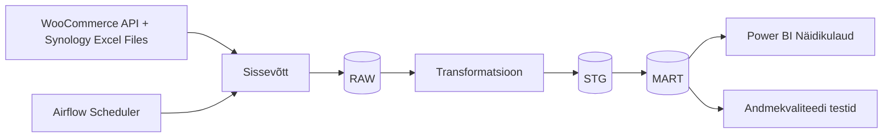

# Arhitektuur

> **Juhend:** See fail on projektitöö esimese nädala väljund. Asenda kõik nurksulgudes plankid oma projekti tegeliku sisuga. Kustuta see juhendrida.

## Äriküsimus

**Äriküsimus**
Millised tooted on e-poes valmis müügiks ja milline on tootearenduses ja hankes
olevate toodete staatus ning millised on ajalises järjestuses järgnevad tegevused, et e-
poe toimimine oleks sujuv ja vastavuses kõigi nõuetega.

**Väärtus**
Väärtus seisneb selles, et töölaud annab ühtse ülevaate toodete staatuse kohta nii e-
poes kui ka tootearenduses ja aitab prioritiseerida ja triažeerida tegevusi mikroettevõttel.

1. Toodete päeva lõpu staatus e-poes - SKU alusel: Mustand; Avalik; Laoseis

2. Tootearenduse/toodete elutsükilstaatus - SKU alusel: Idee; Prototüüp; Testimises; Pre-launch (mustand valmis); Avaldatud (avalik); Arhiveeritud

3. Pakendite staatus - tootearenduse jälgimistabel sisaldab infot, kas toode vajab pakendit; kui "jah", siis järgnevates veerudes on info pakenditüübi kohta, pakendimaterjali hanke staatuse ja omaniku, disaini omaniku ja staatuse ning kas pakendi loomine toimub ettevõttes sees või välise partneri kaudu (binaarne: internal/external)

4. Vastavuskontrolli staatus - valgusfoori põhimõttel tulemus - igal tootel on märgis, kas vajab vastavuskontrolli dokumentatsiooni, ja kui "jah", siis mis liiki ning vastavuskontrolli dokumentatsiooni oleku staatus:
   - Punane: kriitilised dokumendid puudu (blokeerib müüki)
   - Kollane: tegevused pooleli (blokeerib müüki)
   - Roheline: kõik vajalikud protsessid läbitud, dokumendid olemas

## Andmeallikad

| Allikas | Tüüp | Ajas muutuv? | Roll |
|---------|------|--------------|------|
| WooCommerce REST API | API | Jah, [1x / päevas] | Toodete staatus e-poes |
| Tabel: 1_Product_track | API | Jah, [2 X/ nädalas] | Tootearenduse staatus ja täiendav info e-
poe staatusele osas, mille kohta Woo REST APIs sisend puudub |
| Tabel: 2_Packaging_register | API | Jah, [2 X/ nädalas] | Pakendite staatuse ja töövoo jälgimiseks |
| Tabel: 3_Compliance_register | API | Jah, [1 X / nädalas] | Vastavuskontrolli staatuse  jälgimine, tähtaegade jälgimine |

## Andmevoog

## Andmebaasi kihid

| Kiht | Roll |
|------|------|
| `raw` | Hoiab WooCommerce API-st ja Synology Excel failidest sisse loetud toorandmeid võimalikult töötlemata kujul. |
| `stg` | Hoiab puhastatud ja standardiseeritud andmeid, mida kasutatakse edasiseks analüüsiks ja transformatsioonideks. |
| `mart` | Hoiab transformeeritud ja äriloogikat sisaldavaid tabeleid ning KPI-sid, mida kasutatakse Power BI näidikulaual. |

## Tööjaotus

| Roll | Vastutus | Täitja |
|------|----------|--------|
| Andmeallika omanik | Kirjutab sissevõtu loogika, hoiab API-t töös | Merri Elizabeth Laidma |
| Transformatsioonide omanik | Kirjutab mart kihi mudelid ja mõõdikute arvutuse | Lisanne Siniväli |
| Kvaliteedi omanik | Kirjutab testid ja vaatab läbi ebaõnnestunud kontrollid | Eva Radhaa |
| Näidikulaua omanik | Ehitab näidikulaua ja seob selle äriküsimusega | Katrin Saareli |

## Riskid

| Risk | Mõju | Maandus |
|------|------|---------|
| API ühenduse katkemine | Andmeid ei laeta | Kui API ühendus katkeb seetõttu, et e-poe omanik on API võtme rikkunud või peatanud, tuleb see uuesti luua ja koodis asendada. Andmete taastamiseks kasutatakse fallback-mehhanisme ja varukoopiaid, mida SiteGround salvestab 2 korda ööpäevas. Muud API või teenusepoolsed katkestused aktsepteeritakse riskina, kuna need jäävad ettevõtte kontrolli alt välja. Ettevõttel on loodud BCP (Business Continuity Plan), mis kirjeldab tegevusi erinevate tõenäoliste sündmuste korral. Kui probleem tekib WooCommerce’i, WordPressi või hostingu infrastruktuuris, pöördutakse managed hostingu teenusepakkuja toe poole. |
| Excelis loodud tabelites esineb vigu | Tähelepanuta jäänud tähtajad või tegevused võivad põhjustada maine- ja finantsriske | Kehtestatud on regulaarne andmete uuendamise rutiin (1–2 korda nädalas sõltuvalt andmeliigist). Enne iga uuenduse laadimist Synologysse tehakse eelmisest versioonist koopia. Lisaks toimub kord kuus töövoogude inventuur ja kord kvartalis täisinventuur. |
| Andmeleke | GDPR ja teiste vastavusnõuete rikkumise risk | Töölauda ei konsolideerita isikuandmeid. Ligipääs on kaitstud 2FA ja SSO autentimisega. |
| Administraatori vead | Vigane andmete laadimine või kuvamine | Kasutatakse varukoopiaid, mida luuakse 2 korda ööpäevas, ning olemas on rollback-taastamise võimalused. |

## Privaatsus ja turve

Projektis kasutatakse peamiselt operatiivseid äriandmeid, nagu laoseis, tellimustes toodete info
ja toodete staatus. API kaudu kliendi isikuandmeid ei töödelda ega salvestata. Ligipääs
andmetele on piiratud ainult volitatud kasutajatele. Kõik andmebaasi ühendused, API võtmed ja
muud tundlikud seadistused hoitakse .env failis ning neid ei salvestata lähtekoodi.
